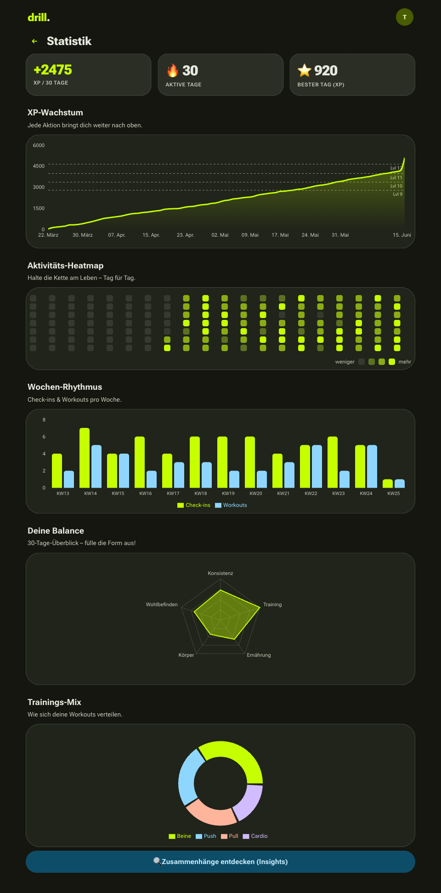

<div align="center">

[](https://drill.celox.io)

# drill

### **train. track. transform.**

Eine multitenant Fitness- & Körper-Tracking-PWA mit Google-Login, Charts, Gamification und Motivations-E-Mails — im **Material 3 Expressive** Look.

[](https://drill.celox.io)
[](LICENSE)


</div>

---

## ✨ Features

- **🔐 Google-Login (multitenant)** — jeder Account ein isolierter Mandant, eigene Daten, eigene Streaks.
- **🧩 Universelles Tracker-System — alles frei nach eigenem Gusto** — der Nutzer definiert selbst, *was* und *wie* er trackt:
  - **6 Eingabetypen:** Zahl (freie Einheit), Skala (z. B. 1–5), Ja/Nein-Gewohnheit, Dauer, Auswahl (eigene Optionen), Notiz/Freitext
  - **Frei konfigurierbar:** Name, Symbol, Farbe, Kategorie, **Ziel + Richtung** (erhöhen/senken/halten), XP pro Eintrag
  - **Vorlagen-Galerie** (Gewicht, Schlaf, Wasser, Stimmung, Schritte …) für 1-Tap-Anlage – alles bleibt editierbar
  - **Editierbare Picker:** eigene Check-in-Aktivitäten & Workout-Kategorien; **Übungs-Bibliothek** mit Autocomplete
- **🎯 Ziele & Bestleistungen** — Ziel-Fortschritt pro Tracker; **automatische Personal-Records** (Epley-1RM) im Training mit Glückwunsch.
- **📈 Flexible Charts & Insights** — Zeitraum-Wahl (7T/30T/90T/1J/alles), gleitender Durchschnitt, **Korrelations-Analyse** zweier Tracker (Pearson-r + Scatter, z. B. Schlaf vs. Stimmung).
- **📊 Motivierende Statistik-Seite** — kumulative **XP-Wachstumskurve** mit Level-Markern, **Aktivitäts-Heatmap** (Intensität = XP/Tag), **Wochen-Rhythmus** (Check-ins vs. Workouts), **Balance-Radar** über alle Lebensbereiche und **Trainings-Donut**.
- **📅 Anwesenheit & Training** — täglicher Check-in mit 17-Wochen-Heatmap; Workouts mit Ort (🏋️ Gym / 🏠 Zuhause / 🌳 Draußen), Kategorie, Dauer und Sätzen (Übung · kg · Wdh.).
- **🏠 Training zuhause** — **Schnellstart-Vorlagen** (💪 Bodyweight · 🔥 HIIT · 🫀 Core · 🧘 Mobility · 🏃 Cardio) loggen in zwei Taps; **Körpergewicht-Modus** blendet das kg-Feld aus (nur Wiederholungen), plus Heim-Übungs-Bibliothek im Autocomplete.
- **⚡ Trainings-Intensität** — maximale Eingabe-Flexibilität: eine Zeile = *N Sätze* (`Sätze`-Spalte), Gewicht überall optional (auch „3 Sätze × 12 Wdh." ohne Gewicht). Sätze, Wiederholungen & Gewichte werden zu einem **Intensitäts-Score** pro Training verrechnet — dafür gibt es **Bonus-XP** (40 Basis + Intensität, gedeckelt).
- **🥗 Ernährung** — Kalorien & Makros **oder** einfache Tagesbewertung + Wasser.
- **🎮 Volle Gamification** — XP pro Aktivität (pro Tracker einstellbar), Level-Kurve, Tages-**Streaks** mit Bonus, **29 freischaltbare Erfolge** inkl. erreichbarer Langzeit-Meilensteine (100-Tage-Serie, 365 Check-ins gesamt, Level 50, 500 t Volumen).
- **🧊 Konfigurierbarer Streak-Schutz** — voll anpassbares „Streak-Freeze"-System: **Wertung** (max. Anzahl, Verdienst-Modi: pro Streak-Meilenstein / pro X Check-ins / Wochengeschenk / bei Level-Up, ob ein geschützter Tag die Serie *wachsen lässt* oder nur *erhält*, automatischer Einsatz) **und Gestaltung** (Name, Symbol, Farbe, Beschreibung). Verpasste Tage werden automatisch überbrückt, solange Schilde vorhanden sind.
- **📧 Motivations-E-Mails** — wöchentlicher Report, Streak-in-Gefahr-Alert, täglicher Nudge. Double-Opt-in + 1-Klick-Abmeldung, geplant via `node-cron`.
- **🎨 Material 3 Expressive + 4 Themes** — tonal surfaces, 10-stufige Shape-Scale, Spring-Motion, emphasized Typography (Roboto Flex). **4 umschaltbare Themes** (Electric Lime · Ember · Aqua · Grape), jeweils komplette tonale Paletten; Auswahl in den Einstellungen, persistiert, mit „Wash"-Übergang. Gut sichtbare Animationen: Seitenübergänge, gestaffeltes Karten-Einblenden, Streak-Ring-Pop, animierte Fortschrittsbalken.
- **📱 PWA** — installierbar, offline-Shell, Service Worker mit versioniertem Cache.
- **🛡️ DSGVO** — vollständiger JSON-Export und unwiderrufliche Konto-/Datenlöschung in den Einstellungen.

## 📊 Statistik & Visualisierung

<div align="center">



</div>

## 🏗️ Architektur

```
┌─────────────────────────────┐         ┌──────────────────────────────┐
│  Frontend (React + Vite)    │  /api   │  Backend (Express)           │
│  Material 3 Expressive PWA  │ ──────▶ │  better-sqlite3 · HMAC-Cookie │
│  Recharts · React Router    │ cookie  │  Google OAuth · node-cron     │
└─────────────────────────────┘         │  nodemailer (Hostinger SMTP)  │
                                         └──────────────┬───────────────┘
                                                        │
                                                  SQLite (WAL)
```

- **Sessions:** HMAC-SHA256-signierte Cookies (kein JWT-Lib), `secure` nur über HTTPS.
- **OAuth:** Authorization-Code-Flow ohne SDK; ID-Token-Verifikation via Google `tokeninfo`.
- **Tracker-System:** voll generisch — ein `trackers`-Eintrag definiert Typ/Einheit/Ziel/XP, `tracker_entries` hält die Werte. Neue Metrik = neuer Datensatz, **keine** Schemaänderung. Logik in `server/trackers.js` (Seeding, Ziel-Fortschritt, 1RM, Korrelation, gleitender Durchschnitt).
- **Gamification:** server-autoritativ — append-only XP-Ledger + denormalisiertes Rollup auf dem User; jeder Tracker-Eintrag vergibt seine konfigurierbare XP. **XP ist rückgängig-fähig:** jedes Event trägt eine Quell-`ref`; beim Löschen einer Aktion werden genau deren XP abgezogen und das Level neu berechnet (Erfolge bleiben erhalten). `scripts/rebuild-xp.js` baut den Ledger deterministisch neu auf.
- **Zeitzonen:** alle „Tage" als `YYYY-MM-DD` in der User-Zeitzone, damit Streaks zur Wanduhr passen.

### Datenmodell (Auszug)

`users` *(inkl. `theme`)* · **`trackers`** (frei definierte Tracker) + **`tracker_entries`** · **`user_options`** (editierbare Picker) · **`personal_records`** · **`streak_freeze`** (Konfig + Stand) + **`freeze_events`** (Ledger) · `checkins` · `workouts` *(mit `place` + `intensity`)* + `workout_sets` *(mit `set_count`)* · `nutrition_logs` · `metrics` *(legacy, migriert in `trackers`)* · `xp_events` *(mit Quell-`ref` für reversible XP)* · `user_achievements` · `email_prefs` · `email_log`

Migrationen sind append-only (`server/migrations.js`): `002_trackers` legt das Tracker-System an und überführt bestehende `metrics`-Werte verlustfrei in Tracker der Kategorie *body*; `003_streak_freeze` ergänzt den konfigurierbaren Streak-Schutz; `004_xp_ref` macht XP rückgängig-fähig; `005_user_theme` speichert das gewählte Theme pro Account; `006_workout_place` ergänzt den Trainings-Ort (Gym/Zuhause/Draußen); `007_set_count_intensity` ergänzt Sätze-pro-Zeile + den Intensitäts-Score.

### API-Überblick (Auszug, alles unter `/api`)

| Methode & Pfad | Zweck |
|---|---|
| `GET/POST /trackers`, `PUT/DELETE /trackers/:id` | Tracker verwalten (seedet Defaults bei leerem Konto) |
| `POST /trackers/reorder` | Reihenfolge speichern |
| `GET/POST /trackers/:id/entries`, `DELETE /entries/:id` | Einträge (vergeben Tracker-XP) |
| `GET /trackers/:id/series?range=&avg=` | Zeitreihe + gleitender Durchschnitt + Ziel |
| `GET /insights/correlation?a=&b=&range=` | Pearson-r + ausgerichtete Paare zweier Tracker |
| `GET/POST /options/:domain`, `DELETE /options/:id` | editierbare Picker (`activity`, `workout_category`) |
| `GET /records` · `GET /exercises` | Personal Records · Übungs-Bibliothek |
| `GET/PUT /streak-freeze` | Streak-Schutz lesen / konfigurieren (Wertung + Gestaltung) |
| `GET /dashboard` · `GET /gamification` · `GET /stats` | Aggregate (Ziele/PRs/Level/Streak · Erfolge · XP-Kurve/Heatmap/Radar) |
| `POST /checkins` · `POST /workouts` · `POST /nutrition` | spezialisiertes Tracking (Streak / Sätze+PR / Makros) |
| `DELETE /checkins/:day` · `/workouts/:id` · `/entries/:id` | Rückgängig — zieht die vergebene XP wieder ab |
| `GET/PUT /me` · `GET /export` · `DELETE /me` | Profil & Theme · DSGVO-Export · Konto löschen |
| `GET /auth/google` · `GET /auth/callback` | Google-OAuth |

## 🚀 Lokale Entwicklung

```bash
# Backend
cd server
cp .env.example .env          # Google-OAuth-Credentials + (optional) SMTP eintragen
npm install
npm run dev                   # http://127.0.0.1:4252

# Frontend (zweites Terminal)
cd ..
npm install
npm run dev                   # http://localhost:5180  (proxyt /api -> :4252)
```

> Für lokalen OAuth-Test in der Google Cloud Console `http://localhost:5180/api/auth/callback`
> als Redirect-URI hinterlegen und `APP_ORIGIN=http://localhost:5180` setzen
> (HTTP relaxt automatisch das `secure`-Cookie-Flag).

### Tests

```bash
cd server && npm test         # node:test — 71 Tests
```
Abgedeckt:
- **Gamification** — Level-Kurve, Streaks, Achievements, **reversible XP** (Undo zieht ab) & `rebuildXp`.
- **Tracker-Logik** — 1RM, Ziel-Fortschritt, Korrelation/Pearson, gleitender Durchschnitt, Default-Seeding.
- **Streak-Freeze** — Überbrückung grow/preserve, Verdienst-Milestones idempotent, Wochengeschenk,
  ISO-Woche, Cap/Consume; plus **Cron-Auto-Bridge** (täglicher Freeze-Einsatz / Streak lapst ohne Schild).
- **Analytics** — XP-Kurve (kumulativ), Heatmap, Wochen-Buckets, Balance-Radar, Kategorien, Level-Marker.
- **Zeit-Mathematik** — `dayInTz`/`addDays`/`diffDays` über Monats-/Jahres-/Schaltjahr-Grenzen.
- **Session-HMAC** — Roundtrip, Manipulations-/Ablauf-/Falschsecret-Erkennung.
- **E-Mail-Templates** — HTML-Escaping (XSS), Confirm-/Unsubscribe-Links.
- **Stats-/Rate-Limiter-Helfer** & **DB-Flows** (Einträge, PRs, Optionen, Cascade-Delete).
- **API-Integrationstests** — App in-memory gebootet, Tracker- + Streak-Freeze-Endpunkte über HTTP mit
  Session-Cookie (inkl. Undo zieht XP ab, Korrelation, PR-Erkennung).

## 📦 Build & Deploy

```bash
npm run build                 # -> dist/   (statische PWA)
```

Vollständige Produktions-Deployment-Anleitung (nginx, systemd, certbot, Backups): **[DEPLOY.md](DEPLOY.md)**.

## ⚙️ Umgebungsvariablen

| Variable | Beschreibung |
|----------|--------------|
| `GOOGLE_CLIENT_ID` / `GOOGLE_CLIENT_SECRET` | OAuth-Credentials |
| `OAUTH_REDIRECT_URI` | `https://drill.celox.io/api/auth/callback` |
| `APP_ORIGIN` | öffentliche Basis-URL |
| `SESSION_SECRET` | `openssl rand -hex 32` |
| `SMTP_USER` / `SMTP_PASS` | Hostinger-SMTP (leer = E-Mails aus) |
| `TZ_NAME` | Zeitzone für Streaks & Cron (`Europe/Berlin`) |

Siehe [`server/.env.example`](server/.env.example) für die vollständige Liste.

## 🎮 XP & Erfolge

| Aktion | XP |
|--------|----|
| Check-in | 25 (+ Streak-Bonus) |
| Workout | 40 |
| Ernährung/Tag | 15 |
| Körpermetrik | 10 |

**29 Erfolge** über alle Bereiche. Serien-Erfolge enden bei der erreichbaren 100-Tage-Marke
(ein verpasster Tag setzt eine Serie zurück); echte Langzeitziele laufen über *kumulative*
Zähler, die Pausen verzeihen:

- **Streaks (am Stück):** Eine Woche (7) · Zwei Wochen (14) · Eiserne Disziplin (30) · Durchmarsch (60) · **Unaufhaltsam (100)**
- **Check-ins (gesamt):** Erster Schritt (1) · Halbes Hundert (50) · Hundertmal dabei (100) · Dauergast (250) · **Ein ganzes Jahr (365)**
- **Workouts (gesamt):** Aufgewärmt (10) · Stammgast (50) · Eisenfreund (100) · **Hantel-Veteran (250)**
- **Volumen (gesamt):** Tonnenweise (25 t) · Schwergewicht (100 t) · **Kraftwerk (500 t)**
- **Bestleistungen:** Neuer Rekord (1) · Rekordjäger (10 PRs)
- **Level:** 5 · 10 · 20 · **50 (👑)**
- **Daten:** Vermessen (1 Eintrag) · Vielseitig (8 Tracker) · Datensammler (100 Einträge) · **Quantified Self (500)**
- **Ernährung:** Bewusst (7 Tage) · Ernährungsprofi (30 Tage)

## 📄 Lizenz

[MIT](LICENSE) © 2026 Martin Pfeffer

<div align="center"><sub>Built with ❤️ and 🏋️ — train. track. transform.</sub></div>
